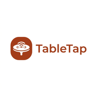
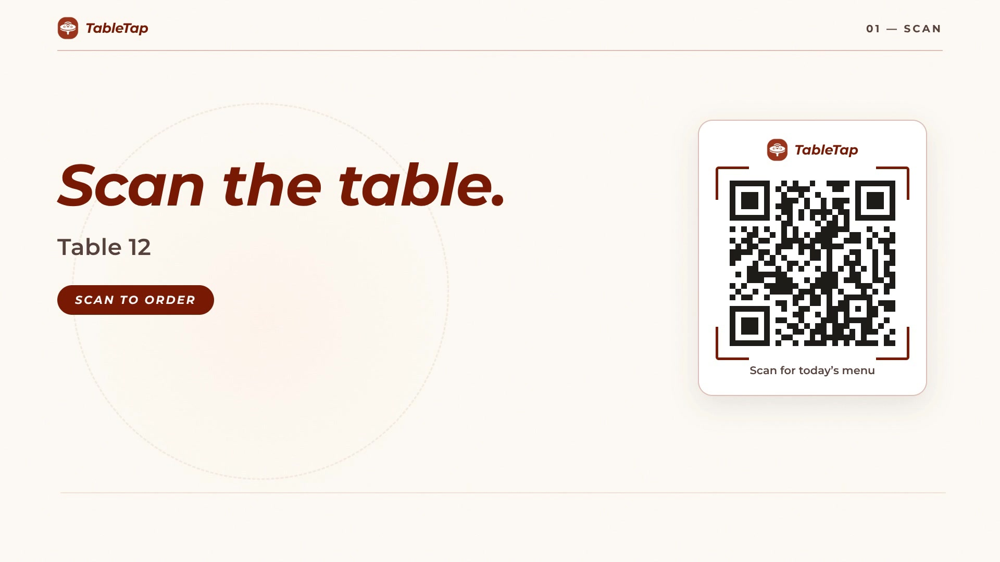

<p align="center">
  
</p>

<h1 align="center">TableTap</h1>

<p align="center">
  A digital table management solution for modern restaurants — QR-powered menu ordering, table sessions, order tracking, and kitchen workflows, all in one place.
</p>

<p align="center">
  <a href="./video/brag.mp4">
    
  </a>
  <br />
  <sub>▶ 22-second launch film — tap to play</sub>
</p>

## Features

- **Customer app (no login)** — a guest scans the table QR and lands on `/t/:id`: live menu with category tabs and search, cart, bill, and checkout with **Pay Online (eSewa)** or **Pay at Counter**, plus a five-step order tracker (Pending → Confirmed → Preparing → Ready → Served).
- **Kitchen board** — live Kitchen Feed of incoming orders with real status transitions: Confirm → Start Cooking → Ready → Served, or Cancel.
- **Waiter & cashier boards** — ready orders for serving, and counter billing/payments for the staff.
- **Admin** — dashboard, user management with roles (`ADMIN`, `WAITER`, `KITCHEN`, `CASHIER`), table management, and menu CRUD.
- **Table sessions** — each scan opens a session on its table; sessions close automatically or by staff.
- **Realtime** — Socket.IO keeps customer, kitchen, and staff screens in sync as orders move.
- **QR codes** — printable per-table QR codes pointing straight at that table's menu.

## Tech stack

| Layer    |                                                                 |
|----------|-----------------------------------------------------------------|
| Frontend | React 19, TypeScript, Vite, Tailwind CSS 4, React Router 7, Socket.IO client, qrcode.react |
| Backend  | Express 5, TypeScript, Prisma (PostgreSQL), Socket.IO, JWT auth, Zod, Cloudinary, node-cron |
| Infra    | Docker Compose (backend :3000, frontend :5173)                   |

## Getting started

**Docker (both services):**

```bash
docker compose up --build
```

**Local dev:**

```bash
# backend — needs backend/.env with at least DATABASE_URL and JWT_ACCESS_SECRET
cd backend
npm install
npx prisma db push
npm run prisma:seed
npm run dev          # http://localhost:3000

# frontend — needs frontend/.env with VITE_API_BASE_URL
cd ../frontend
npm install
npm run dev          # http://localhost:5173
```

The seed creates a default admin: `admin@restaurant.com` / `ChangeMe123!`
(override with `ADMIN_EMAIL` / `ADMIN_PASSWORD` — change it after first login).

Open a table menu at `http://localhost:5173/t/<table-id>` (or scan a generated QR), and sign in at `/login` for the staff boards.

## Project layout

```
backend/    Express API, Prisma schema, Socket.IO, seed
frontend/   React app — customer app + kitchen/waiter/cashier/admin boards
brag-output/  Launch film (brag.mp4), poster, storyboard, Hyperframes composition
```
